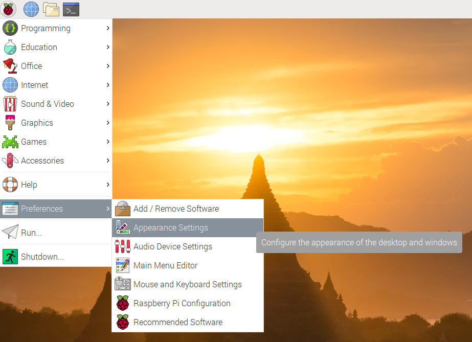
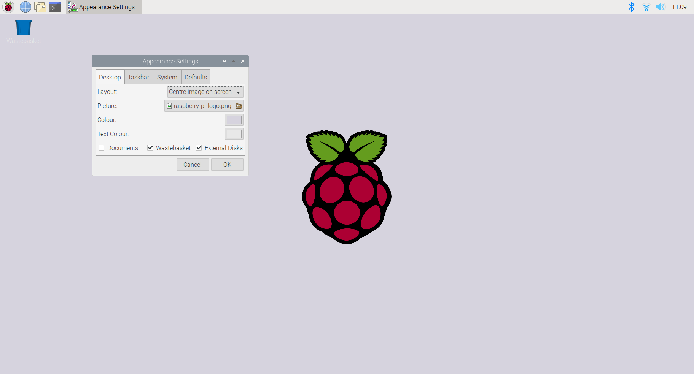

## Change the wallpaper

The background wallpaper for the Raspbian desktop is a temple with a beautiful sunset in the background. You don't have to keep this wallpaper, you can change it to one you prefer. You can also change the colour of the text for icons on the desktop so that it contrasts with the wallpaper and is easy to read.

--- task ---

Click on the Raspberry in the top left of your screen to open the Main Menu and then choose `Preferences` and `Appearance Settings`. 

Tip: You can also use the Windows key on your keyboard to open the Main Menu.

This will open the Appearance Settings window.

Tip: You can also right-click on the desktop and choose 'Desktop Preferences' to open the Appearance Settings window.
--- /task ---

--- task ---

The selected Picture is 'temple.jpg'. Click to change this and you will see a choice of images. Choose 'aurora.jpg' and click 'Open' to change the wallpaper. 

The new wallpaper will be shown immediately. 

--- /task ---

--- task ---

Now change the wallpaper to 'raspberry-pi-logo.png'. You'll see that the image is used to fill the whole screen which doesn't work very well.

--- /task ---

--- task ---

Change the 'Layout' to 'Tile image' to fill the screen with lots of copies of the logo.

--- /task ---

--- task ---

Now change the 'Layout' to 'Centre image on screen' to get just one Raspberry Pi logo in the centre. 

--- /task ---

With the default background color and text settings it's hard to read the icon labels on the desktop. This is because there's not enough contrast (difference) between the two colours.

You can change these settings to get background and text colours with better contrast so that the label text is easier to read. 

--- task ---

When using the tiled or centred layouts, it's useful to be able to change the background colour. Click on the colour selector to the right of 'Colour'.

Pick a colour that you think works well with the Raspberry Pi logo. 

First, select a colour (hue) from the outer ring. Then choose the exact shade using the inner triangle.

--- /task ---

You'll see that the other ways of entering colours update in when you choose a colour with the colour picker. 

You can also specify colours in the following ways:

- Hue/Saturation/Value: The Hue gives the colour (from 0 to 359) and the Saturation gives the amount of the colour and the Value gives the brightness of the colour. Scratch 3 uses a similar approach to specify colours. 
- Red/Green/Blue (RGB): Specify the amount of Red, Green and Blue (from 0 to 255) that are mixed to produce the colour. Colours for display on a computer screen are often specified using RGB because each pixel (dot on the screen) combines these three colours to produce the colour you see. 
- Hex: Hex colour codes start with a # (hash) symbol and then have three pairs of numbers to represent the amount of red, green and blue. The characters use the digits 0-9 then then letters A-F (to represent 10-15). This is called hexadecimal (hex for short.) This means that in two characters you can represent 16 x 16 = 256 different values for each colour. Hex colours are widely used on the web.

Using the colour ring and triangle to enter colours is easier for humans, but it's easier for computers to store colours as numbers. Working with numbers also makes it easy for us to use exactly the same colour in different places. 

--- task ---
Try choosing different colours with the colour picker and see how the different colour representations change. 

--- /task ---

--- task ---
You may also want to change the 'Text' colour so that it's clearer on your choice of background.

The hex colour code for the raspberry colour in the Raspberry Pi logo is '#C51A4A' (a lot of red mixed with a small amount of green and some blue.)

--- /task ---

