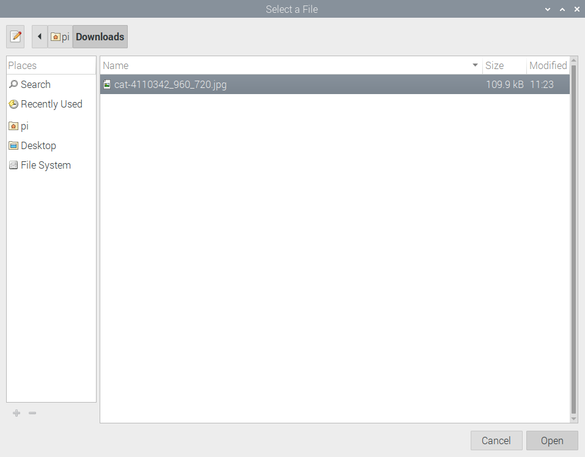
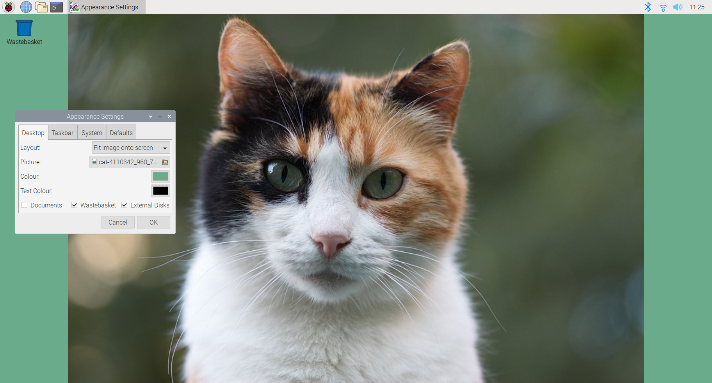
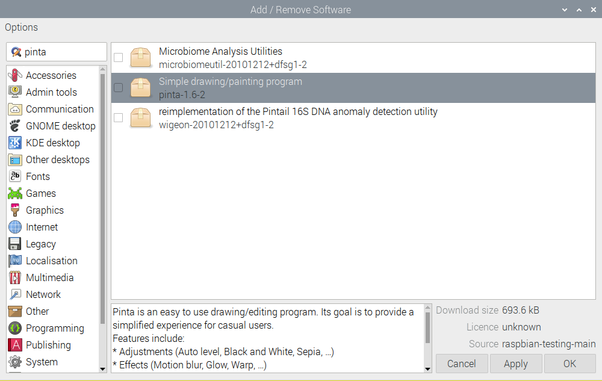

## Challenge: Choose your favourite wallpaper

Now try out the different wallpapers and settings and find your favourite. You may also need to change the Text colour so that it's clear or just because you prefer a different colour. 

If you have access to the internet you could also download images that you have permission to use. You can choose a picture from your Downloads folder by selecting `pi` and then `Downloads`.

Change the other settings to get the result you want. 

Tip: If you want to browse the included desktop images you can find them in the File System under '/usr/share/rpd-wallpaper'.

You could even draw your own picture. If you have full Raspbian installation then you could use LibreOffice Draw or Scratch.  

If you have internet access then you could install Pinta. Main Menu and choose `Preferences` and then `Add / Remove Software` then you can search for and add 'Pinta', a simple drawing and painting program. 

