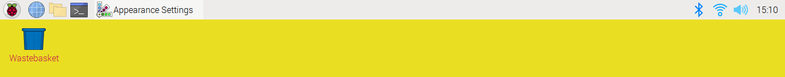
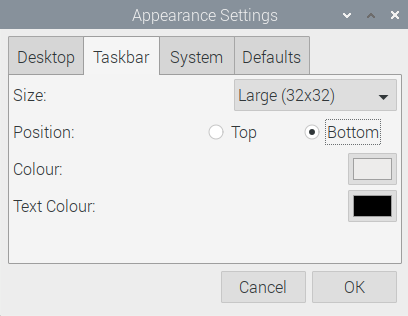
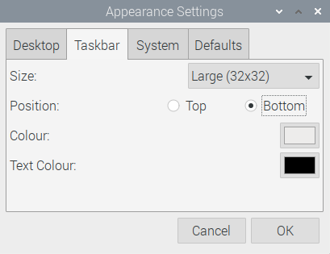
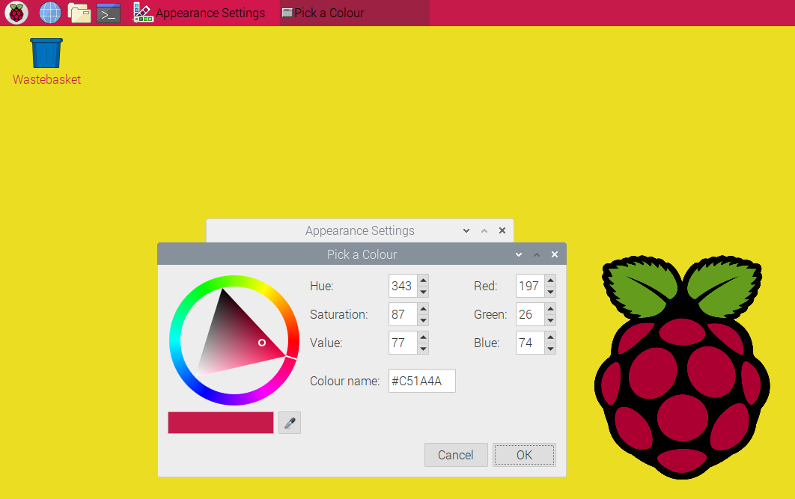
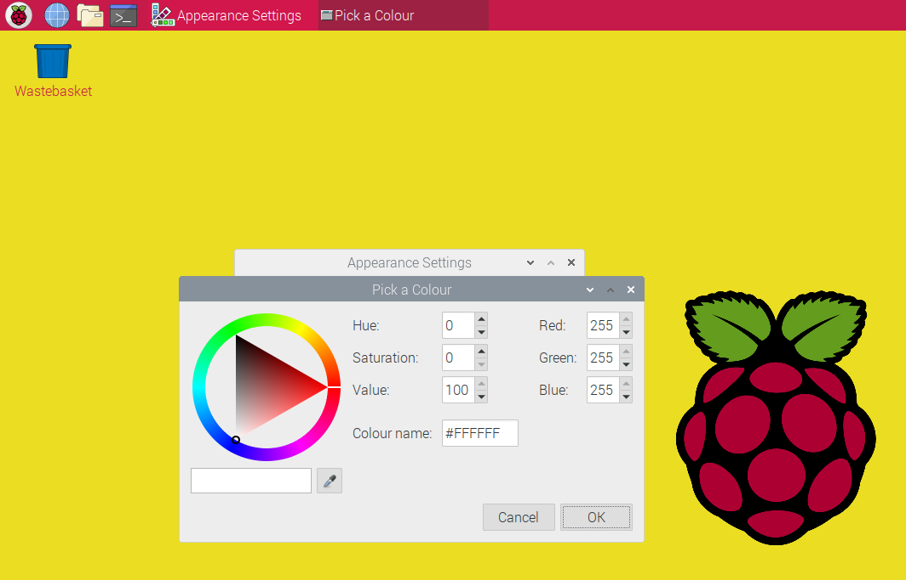

## Change the taskbar and highlight colour

The **taskbar** allows you to access the main menu (Raspberry Pi icon), open commonly used applications and select currently open applications, and access useful settings and information. 

The default position of the taskbar is at the top of the desktop. 

--- task ---

Go to the main menu, then click on **Preferences**. Open the **Appearance Settings** dialog box. Click on the **Taskbar** tab.

This will open the settings for the taskbar.

--- /task ---

By default, the taskbar is positioned at the top of the screen. If you have used another operating system before, then you may be used to having the taskbar at the bottom of the screen.

--- task ---

Change the position to **Bottom** to move the taskbar to the bottom of the screen.

The taskbar will move immediately. 

Depending on your preference, you can either leave the taskbar at the bottom, or move it back to the top. 

If you've never tried using the taskbar at the top of the screen, then try it and see if you prefer it.

--- /task ---

You can also change the background and text colours for the taskbar. 

The hex colour code for white is **#FFFFFF**, which means the maximum amount of red, green, and blue. Click on **OK** and the taskbar will update to use the new colour scheme. 

--- task ---

In **Appearance Settings**, open the **Taskbar** tab and change the colour to `#C51A4A` (raspberry red).

--- /task ---

--- task ---

Change the **Text Colour** to `#FFFFFF` (white).

Notice that the text in the taskbar is now white. 

--- /task ---

