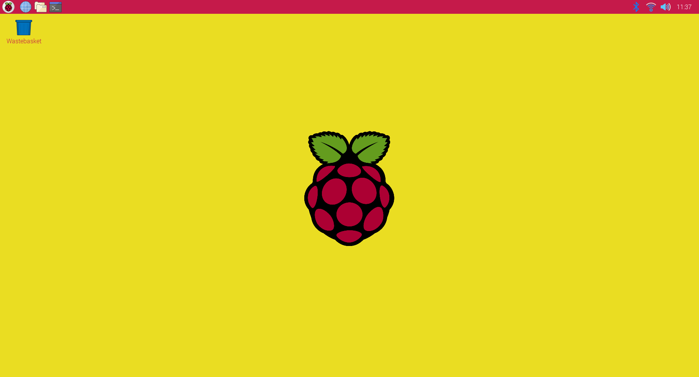

## Change the taskbar

The Taskbar allows you to access the Main Menu (Raspberry), allows you to open commonly used applications and select currently open applications, allows you to access useful settings and information. 

--- task ---

Open the Appearance Settings dialog from the Preferences section of the Main Menu. Click on the Taskbar tab.

This will open the settings for the Taskbar.

--- /task ---

By default, the Taskbar is positioned at the top of the screen. If you have used another operating system then you may be used to having the Taskbar at the bottom of the screen.

--- task ---

Change the position to Bottom to move the Taskbar.

The taskbar will move immediately. 

You can either leave the Taskbar at the bottom or move it back to the top depending on your preference. 

If you've never tried using the Taskbar at the top of the screen then give it a go and see if you prefer it.

--- /task ---

You can also change the background and text colours for the Taskbar. 

This time, we'll use the 'Colour name' input to enter hexadecimal colour values. This way of representing colours is commonly used on the web. 

[ingredient??]

The hex colour code for white is '#FFFFFF' which means the maximum amount of red, green and blue. 

The hex colour code for the raspberry colour in the Raspberry Pi logo is '#C51A4A' (a lot of red mixed with a small amount of green and some blue.)

--- task ---

Open the Taskbar tab of Appearance settings and change the colour to 'C51A4A' (raspberry red).

--- /task ---

--- task ---

Change the Text Colour to '#FFFFFF' (white).

--- /task ---

The Taskbar will immediately update to use the new colour scheme. 

