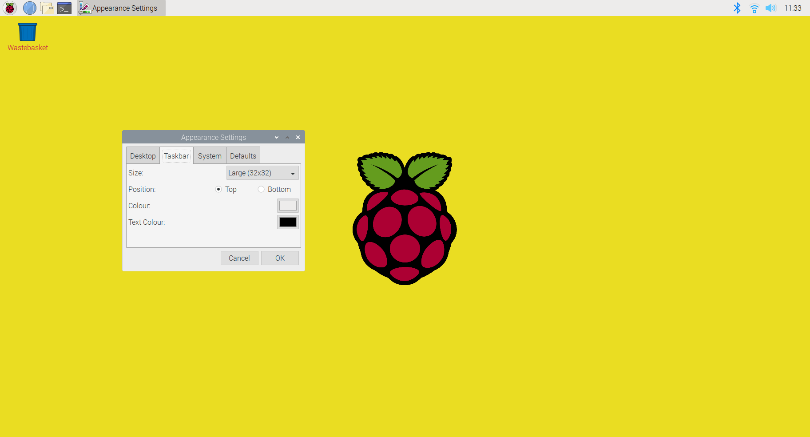
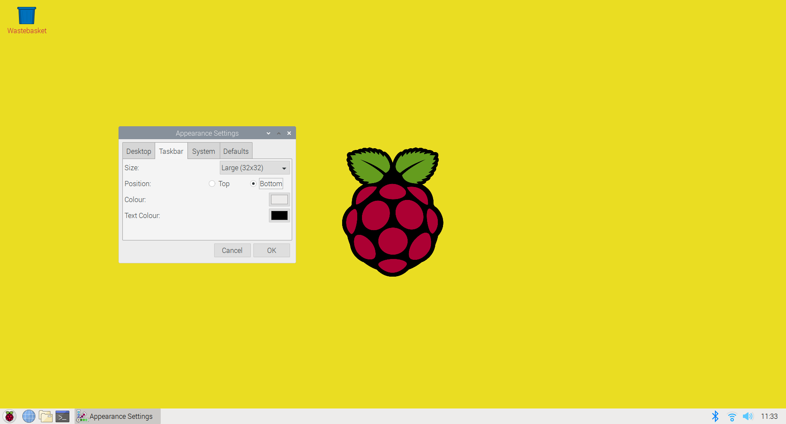

## Change the taskbar and highlight colour

The Taskbar allows you to access the Main Menu (Raspberry), open commonly used applications and select currently open applications, and access useful settings and information. 

The default position of the taskbar is at the top of the desktop. 

--- task ---

Open the `Appearance Settings` dialog from the `Preferences` section of the Main Menu. Click on the `Taskbar` tab.

This will open the settings for the Taskbar.

--- /task ---

By default, the Taskbar is positioned at the top of the screen. If you have used another operating system then you may be used to having the Taskbar at the bottom of the screen.

--- task ---

Change the position to Bottom to move the Taskbar.

The taskbar will move immediately. 

You can either leave the Taskbar at the bottom or move it back to the top depending on your preference. 

If you've never tried using the Taskbar at the top of the screen then give it a go and see if you prefer it.

--- /task ---

You can also change the background and text colours for the Taskbar. 

The hex colour code for white is '#FFFFFF' which means the maximum amount of red, green and blue. Click OK and the Taskbar will update to use the new colour scheme. 

--- task ---

Open the Taskbar tab of Appearance settings and change the colour to 'C51A4A' (raspberry red).

--- /task ---

--- task ---

Change the Text Colour to '#FFFFFF' (white).

--- /task ---

