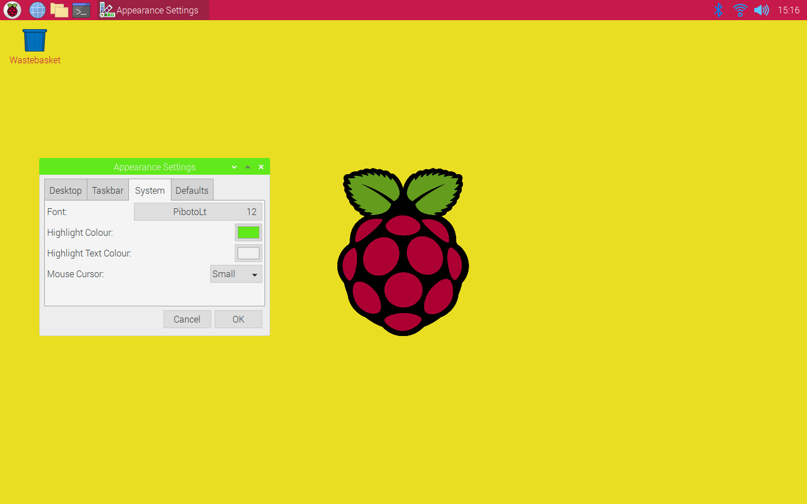

## Challenge: choose your favourite taskbar and system settings

Now try out the different settings for the taskbar. Choose the position, the size of the icons, and the colour scheme.

Remember to think about the contrast between the colours that you choose so that it's easy to read the names of the applications that are open.

In **Appearance Settings**, go to the **System** tab to find other settings you can change. Try changing the **Highlight Colour**: this will change the colour of items that are selected, including the bar on the window that is currently selected. You can change the font and size of the text too.

Note that when you change the mouse cursor size, you have to reboot your Raspberry Pi. Try it, if you like — it won't take long! 

**Tip:** To reboot (restart) your Raspberry Pi, open the main menu and choose **Shutdown**, then **Reboot**.

