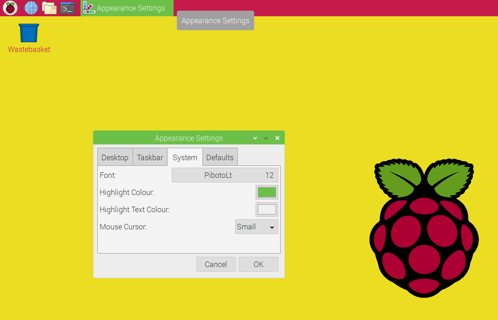

## Challenge: Choose your favourite taskbar and system settings

Now try out the different settings for the taskbar. Choose the position, the size of icons and the colour scheme.

Remember to think about the contrast between the colours you choose so that it's easy to read the names of currently open applications.

Look the `System` tab of `Appearance Settings` to find other settings you can change. Try changing the highlight colour, this will change the colour of selected items includind the bar on the currently selected window. You can change the font and size of text too. 

Note that changing the mouse cursor size requires a reboot. Why not try it, it won't take long. 

Tip: To reboot (restart) your Raspberry Pi, open the Main Menu and choose `Shutdown` then `Reboot`.

